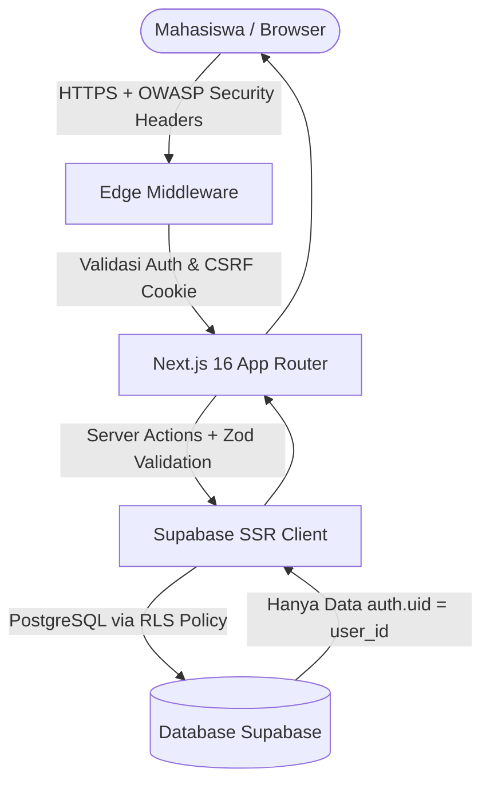

<div align="center">

  

  # **ngampUS**
  ### *Your Modern Campus Command Center*

  <p align="center">
    <b>Personal workspace cerdas untuk mahasiswa aktif yang ingin menjaga jadwal kuliah, tugas, organisasi, proker, dan target prestasi tetap dalam satu kendali.</b>
  </p>

  <p align="center">
    <a href="#-fitur-unggulan">Fitur Unggulan</a> •
    <a href="#-arsitektur--keamanan">Arsitektur & Keamanan</a> •
    <a href="#-cara-menjalankan-secara-lokal">Cara Menjalankan</a> •
    <a href="#-struktur-proyek">Struktur Proyek</a> •
    <a href="#-kontribusi">Kontribusi</a>
  </p>

  <p align="center">
    
    
    
    
    
    
  </p>

  <br/>

  

</div>

---

## 🌟 Mengapa nGampUS?

Banyak mahasiswa merasa kewalahan mengatur jadwal kuliah yang tercecer di grup WhatsApp, tugas yang tertumpuk di catatan HP, serta timeline program kerja organisasi yang berantakan.

**nGampUS** hadir dengan filosofi **Campus Atlas / Campus Console**:
- 🧭 **Satu Peta Kendali**: Jadwal kelas, tugas kuliah, rapat organisasi, dan kalender akademik saling terhubung secara terstruktur.
- ⚡ **Fokus Tanpa Distraksi**: Dashboard proaktif yang otomatis menghitung deadline terdekat, kelas hari ini, dan target semester.
- 🎯 **Portofolio Otomatis**: Setiap kontribusi di kepanitiaan, lomba, dan proker otomatis dirangkum jadi rekap portofolio siap pakai untuk CV.

---

## 🚀 Fitur Unggulan

### 1. 🎓 Onboarding Interaktif & Guided Tour
* **Smart First-Time Detection**: Mahasiswa yang baru mendaftar langsung disambut oleh wizard setup semester dengan rentang tanggal perkiraan otomatis.
* **1-Minute Spotlight Feature Tour**: Sorotan visual interaktif yang memperkenalkan letak tombol dan fitur inti nGampUS agar pengguna baru tidak kebingungan.
* **Anti-Spam State**: Status tur tersimpan per akun, serta dapat diputar ulang (*replay*) kapan saja melalui tombol **Panduan** di sidebar.

### 2. 📅 Jadwal Kuliah & Ruang Kelas Virtual
* **Jadwal Mingguan Interaktif**: Pantau jadwal perkuliahan hari Senin hingga Minggu lengkap dengan jam mulai-selesai, jumlah SKS, nama dosen pengampu, kontak, dan ruangan.
* **Akses Kelas Virtual 1-Klik**: Tombol pintas langsung membuka tautan Google Meet / Zoom dan tautan materi kuliah tanpa perlu mencari di chat grup.
* **Tipe Kuliah**: Label visual yang jelas untuk perkuliahan *Offline*, *Online*, dan *Hybrid*.

### 3. 📝 Manajemen Kegiatan & Deadline Pintar
* **Kaitan Mata Kuliah**: Saat mencatat tugas kategori kuliah, mahasiswa dapat memilih mata kuliah terkait dari semester yang sedang berjalan.
* **Status Deadline Fleksibel**: Mendukung tugas **Terjadwal** (dengan tanggal & jam deadline) maupun kegiatan **Belum Ditentukan**.
* **Progress Auto-Sync**: Status otomatis berpindah dari *Belum Mulai* ke *On Progress* ketika tanggal pelaksanaan tiba.

### 4. 🏢 Organisasi, Jabatan & Program Kerja (Proker)
* **Struktur Peran Dinamis**: Kelola posisi di BEM, Himpunan, UKK/UKM mulai dari Ketua Umum, Sekretaris, Bendahara, Kepala Departemen, hingga Anggota.
* **Monitoring Proker**: Pantau status program kerja mulai dari tahap perencanaan, berjalan, selesai, hingga arsip.

### 5. 🏆 Rekap Portofolio & Ekspor Data
* **Auto-Curated Portfolio**: Beri tanda bintang pada kegiatan organisasi atau lomba agar otomatis masuk ke galeri portofolio semester.
* **Ekspor CSV UTF-8**: Unduh rekapitulasi data akademik dan kegiatan untuk arsip pribadi atau lampiran beasiswa.

---

## 🛡️ Arsitektur & Keamanan Siber (Enterprise-Grade)

Keamanan privasi dan data mahasiswa di nGampUS dilindungi dengan prinsip **Defense-in-Depth**:

| Komponen Keamanan | Implementasi di nGampUS |
| :--- | :--- |
| **Row Level Security (RLS)** | Seluruh tabel PostgreSQL Supabase dilindungi RLS ketat (`auth.uid() = user_id`). Tidak ada data pengguna lain yang bisa dibaca atau diubah. |
| **Edge Auth Middleware** | Next.js Middleware di level edge memeriksa auth session dan secara otomatis me-refresh session cookie dengan opsi `SameSite=Lax` & `Secure`. |
| **Content-Security-Policy (CSP)** | Membatasi skrip eksternal dan hanya mengizinkan koneksi aman ke server nGampUS dan Supabase endpoint (`*.supabase.co`). |
| **Anti-Clickjacking** | Menggunakan header `X-Frame-Options: DENY` dan `frame-ancestors 'none'` untuk mencegah web dibungkus iframe penipuan. |
| **Anti-XSS URL Protocol Filter** | Validasi skema URL ketat (`/^https?:\/\//i`) pada seluruh input link meet, materi, LinkedIn, dan GitHub untuk memblokir eksploitasi `javascript:`. |
| **MIME Sniffing & HSTS Protection** | `X-Content-Type-Options: nosniff` dan `Strict-Transport-Security` (HSTS) selama 2 tahun (`max-age=63072000`). |



---

## 💻 Tech Stack

- **Framework**: [Next.js 16 (App Router)](https://nextjs.org/) dengan **React 19**
- **Bahasa**: [TypeScript](https://www.typescriptlang.org/) (Strict Mode)
- **Styling**: [Tailwind CSS v4](https://tailwindcss.com/) + CSS Custom Design Tokens
- **Database & Auth**: [Supabase](https://supabase.com/) (PostgreSQL, Supabase Auth SSR, Row Level Security)
- **Validasi Data**: [Zod](https://zod.dev/) & [React Hook Form](https://react-hook-form.com/)
- **Ikonografi & UI**: [Lucide React](https://lucide.dev/), [date-fns](https://date-fns.org/)
- **Kalender**: [FullCalendar](https://fullcalendar.io/)

---

## 🛠️ Cara Menjalankan Secara Lokal

### Prasyarat
- Node.js versi 20 atau yang lebih baru
- Akun dan project [Supabase](https://supabase.com) aktif

### 1. Kloning Repositori
```bash
git clone https://github.com/YogUNI/nGampUS.git
cd nGampUS
```

### 2. Instalasi Dependensi
```bash
npm install
```

### 3. Konfigurasi Environment Variable
Salin file `.env.example` menjadi `.env.local`:
```bash
cp .env.example .env.local
```
Lengkapi isian kredensial Supabase Anda di `.env.local`:
```env
NEXT_PUBLIC_SUPABASE_URL=https://your-project.supabase.co
NEXT_PUBLIC_SUPABASE_PUBLISHABLE_KEY=your-anon-key
```

### 4. Setup Database Supabase
Buka **SQL Editor** di dashboard Supabase Anda, lalu jalankan script berikut secara berurutan:
1. `supabase/schema.sql` (Skema tabel utama & RLS)
2. `supabase/migrations/20260913_create_courses_table.sql` (Tabel jadwal kuliah mingguan)

### 5. Jalankan Development Server
```bash
npm run dev
```
Buka browser di [http://localhost:3000](http://localhost:3000) untuk mengakses aplikasi.

---

## 📁 Struktur Proyek

```text
nGampUS/
├── public/                     # Aset statis & logo nGampUS
│   ├── logo_ngampUS.png        # Logo resmi nGampUS
│   └── ngampus-preview.svg     # Banner visual preview
├── src/
│   ├── app/
│   │   ├── (auth)/             # Halaman login, register, lupa password
│   │   ├── (dashboard)/        # Halaman workspace utama mahasiswa
│   │   │   ├── dashboard/      # Command center & widget fokus harian
│   │   │   ├── jadwal/         # Manajemen jadwal kuliah mingguan
│   │   │   ├── kegiatan/       # Manajemen tugas, reminder & deadline
│   │   │   ├── organisasi/     # Ruang kelola organisasi, peran & proker
│   │   │   ├── semester/       # Kalender akademik & kontrol semester
│   │   │   ├── rekap/          # Rekap statistik & galeri portofolio CV
│   │   │   └── settings/       # Pengaturan profil & keamanan akun
│   │   └── layout.tsx          # Root layout
│   ├── components/
│   │   ├── activities/         # Komponen form tugas & kalender
│   │   ├── dashboard/          # Sidebar responsive & topbar
│   │   ├── onboarding/         # Onboarding wizard & spotlight tour
│   │   ├── schedule/           # Grid jadwal mingguan & modal matkul
│   │   └── settings/           # Form profil, KTM preview & crop modal
│   ├── lib/                    # Supabase client, helper & date utilities
│   └── middleware.ts           # Next.js edge auth & security shield
├── supabase/
│   ├── schema.sql              # Skema database & konfigurasi RLS
│   ├── SECURITY_CHECKLIST.md   # Panduan audit keamanan database
│   └── migrations/             # Berkas migrasi database bertahap
└── next.config.ts              # Konfigurasi Next.js & HTTP Security Headers
```

---

## 🤝 Kontribusi

Kontribusi dari sesama mahasiswa dan pengembang selalu disambut dengan hangat!
1. Fork repositori ini
2. Buat branch fitur baru (`git checkout -b fitur/nama-fitur-keren`)
3. Commit perubahan Anda (`git commit -m "feat: menambahkan fitur baru"`)
4. Push ke branch Anda (`git push origin fitur/nama-fitur-keren`)
5. Ajukan **Pull Request**

---

<div align="center">
  <p>Dibuat dengan dedikasi untuk mahasiswa Indonesia 🇮🇩</p>
  <p>© 2026 <b>nGampUS</b>. Hak Cipta Dilindungi.</p>
</div>
