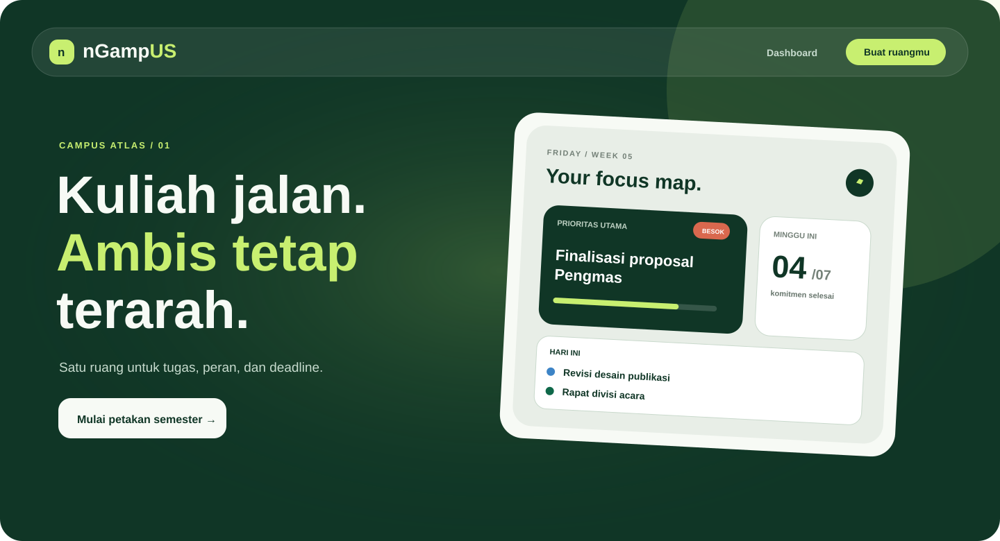
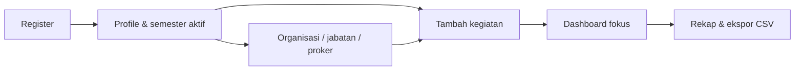
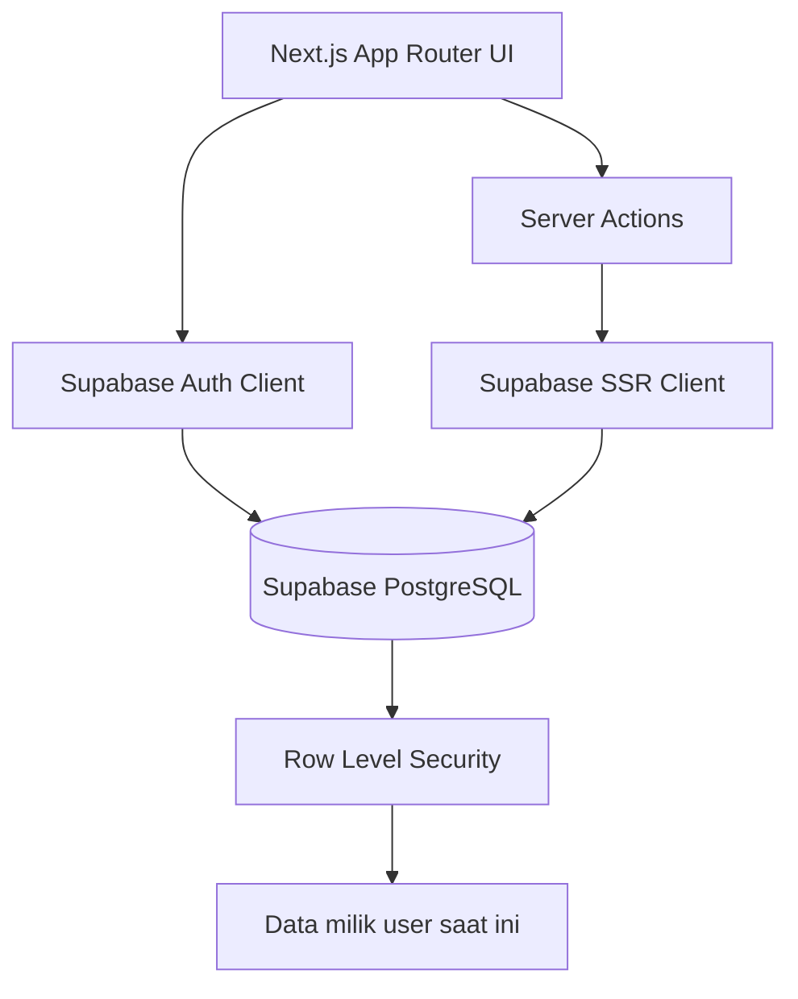
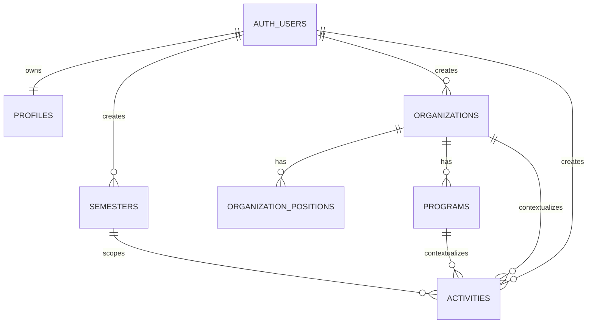

<div align="center">

# ngampUS

### Your campus command center

_Personal workspace untuk mahasiswa aktif yang ingin menjaga kuliah, organisasi, program kerja, dan deadline tetap satu arah._

[](https://nextjs.org/)
[](https://react.dev/)
[](https://supabase.com/)
[](https://www.typescriptlang.org/)

[Mulai lokal](#menjalankan-secara-lokal) · [Fitur](#fitur-utama) · [Setup Supabase](#setup-supabase) · [Arsitektur](#arsitektur)

Untuk handoff ke AI agent atau maintainer baru, baca [Project Context for Antigravity](./docs/ANTIGRAVITY_PROJECT_CONTEXT.md).

<br/>



</div>

---

## Tentang ngampUS

ngampUS bukan sekadar to-do list. Aplikasi ini dibuat sebagai **campus atlas**: satu tempat untuk menangkap semua komitmen mahasiswa, menautkannya dengan semester dan organisasi, lalu mengubahnya menjadi fokus harian yang lebih jelas.

Desainnya memakai konsep **Campus Atlas / Campus Console**—nuansa hijau tua, mint, dan papan fokus yang membuat data terasa seperti peta kerja personal, bukan tabel administrasi.

## Fitur utama

| Area | Yang bisa dilakukan |
| --- | --- |
| 🔐 **Authentication** | Register, login, logout, session SSR, dan route workspace terlindungi. |
| 👤 **Profil mahasiswa** | Kelola nama, email Auth, universitas, program studi, NIM, WhatsApp, dan bio. |
| 🎓 **Semester** | Buat semester, pilih satu semester aktif, edit, dan hapus dengan konfirmasi. |
| 🏛️ **Organisasi** | Simpan organisasi/UKM/kepanitiaan, peran, divisi, dan catatan kontribusi. |
| 🪪 **Jabatan terstruktur** | Ketua, wakil, sekretaris, bendahara, kepala/wakil kepala departemen, anggota, atau role kustom. |
| 💼 **Program kerja** | Tambah proker per organisasi, isi peran, status, deskripsi, dan periode. |
| ✅ **Kegiatan** | Catat tugas, reminder, atau catatan dengan prioritas, status, tanggal, deadline, dan konteks organisasi. |
| 🗓️ **Kalender & filter** | Filter per semester, organisasi, kategori, prioritas, status; lihat juga kalender bulanan. |
| 📊 **Dashboard & rekap** | Metrik semester aktif, deadline dekat, progress, distribusi kategori, dan ekspor CSV UTF-8. |
| 🔒 **Data terisolasi** | Setiap tabel menggunakan Row Level Security (RLS); user hanya dapat melihat dan mengubah datanya sendiri. |

## Alur produk



## Teknologi

| Layer | Teknologi |
| --- | --- |
| Framework | Next.js 16 App Router + React 19 |
| Language | TypeScript |
| Styling | Tailwind CSS 4 + design tokens CSS |
| Backend | Supabase PostgreSQL, Auth, SSR cookies, RLS |
| Validasi form | React Hook Form + Zod |
| Kalender | FullCalendar |
| Ikon & utility | Lucide React, date-fns, clsx, tailwind-merge |

## Arsitektur



## Menjalankan secara lokal

### Prasyarat

- Node.js 20 atau lebih baru
- npm
- Project Supabase

### 1. Clone dan install

```bash
git clone https://github.com/YogUNI/nGampUS.git
cd nGampUS
npm install
```

### 2. Siapkan environment variable

Salin file contoh:

```bash
copy .env.example .env.local
```

Isi `.env.local` menggunakan nilai dari **Supabase Dashboard → Connect**:

```env
NEXT_PUBLIC_SUPABASE_URL=https://your-project.supabase.co
NEXT_PUBLIC_SUPABASE_PUBLISHABLE_KEY=your_publishable_key
```

> Jangan commit `.env.local`. Aplikasi ini tidak memerlukan `SUPABASE_SERVICE_ROLE_KEY` untuk berjalan di browser.

### 3. Jalankan aplikasi

```bash
npm run dev
```

Buka [http://localhost:3000](http://localhost:3000).

## Setup Supabase

> **Penting:** jangan menjalankan ulang `schema.sql` pada project yang sudah berisi data. Gunakan migration yang belum pernah dijalankan saja.

### Project Supabase baru

Buka **SQL Editor**, lalu jalankan file berikut secara berurutan:

1. [`supabase/schema.sql`](./supabase/schema.sql)
2. [`20260829_expand_profiles.sql`](./supabase/migrations/20260829_expand_profiles.sql)
3. [`20260830_add_organization_position_roles.sql`](./supabase/migrations/20260830_add_organization_position_roles.sql)
4. [`20260830_profile_academic_fields.sql`](./supabase/migrations/20260830_profile_academic_fields.sql)
5. [`20260830_fix_profile_academic_trigger_email.sql`](./supabase/migrations/20260830_fix_profile_academic_trigger_email.sql)

### Project yang sudah berjalan

Jalankan **hanya migration yang belum pernah dijalankan**, tetap dalam urutan yang sama. Migration terakhir harus dijalankan setelah `20260829_expand_profiles.sql` karena memperbarui trigger profile agar menyimpan `email`, `university`, dan `major` dari metadata register.

### Konfigurasi Auth untuk lokal

Di **Authentication → Sign In / Providers**:

1. Pastikan provider **Email** aktif.
2. Untuk testing lokal cepat, nonaktifkan **Confirm email**.
3. Jika Confirm email tetap aktif, tambahkan `http://localhost:3000` pada **URL Configuration**, konfirmasi email, lalu login.

### Verifikasi data register

Setelah menjalankan migration terakhir, buat akun baru lalu periksa profile-nya:

```sql
select id, email, full_name, university, major
from public.profiles
order by created_at desc;
```

## Model data



### Tabel inti

| Tabel | Tanggung jawab |
| --- | --- |
| `profiles` | Identitas dan informasi kampus user. |
| `semesters` | Riwayat semester dan penanda semester aktif. |
| `organizations` | Organisasi, UKM, UKK, kepanitiaan, atau ruang kontribusi lain. |
| `organization_positions` | Jabatan, role type, divisi, dan rentang waktu peran. |
| `programs` | Program kerja per organisasi. |
| `activities` | Tugas, reminder, dan catatan yang terhubung ke konteks lain. |

## Keamanan data

- Semua tabel inti memakai **Row Level Security**.
- Policy membatasi `select`, `insert`, `update`, dan `delete` ke `auth.uid()` user saat ini.
- Relasi organisasi, jabatan, proker, dan kegiatan ikut memverifikasi kepemilikan user.
- Service role key tidak digunakan di client.

### Cara menguji RLS

1. Buat akun A dan akun B.
2. Dengan akun A, buat semester, organisasi, jabatan, proker, serta kegiatan.
3. Logout, lalu masuk sebagai akun B.
4. Pastikan akun B tidak dapat melihat, mengubah, atau menghapus data akun A.

## Struktur project

```text
src/
├── app/
│   ├── (auth)/                 # Login, register, dan auth layout
│   ├── (dashboard)/            # Dashboard, kegiatan, organisasi, rekap, settings
│   ├── page.tsx                # Landing page Campus Atlas
│   ├── globals.css             # Design tokens dan visual system
│   └── proxy.ts                # Proteksi route berbasis session
├── components/
│   ├── activities/             # Form, edit form, dan calendar
│   ├── auth/                   # Form + visual auth
│   ├── dashboard/              # Sidebar dan mobile topbar
│   ├── organizations/          # Form organisasi dan jabatan
│   ├── recap/                  # Export CSV
│   └── ui/                     # Komponen UI reusable
└── lib/
    ├── activity-styles.ts      # Mapping warna kategori/status
    └── supabase/               # Client browser dan server

supabase/
├── schema.sql                  # Schema awal: table, constraint, RLS, view
└── migrations/                 # Upgrade aman untuk project existing
```

## Perintah quality check

```bash
npx tsc --noEmit
npm run lint
npm run build
```

## Kontribusi

Issue, saran UX, dan pull request sangat terbuka. Untuk perubahan yang menyentuh database, selalu sertakan migration baru di `supabase/migrations/` dan jangan memodifikasi migration yang sudah digunakan di production.

---

<div align="center">

Made for students who are building more than a schedule. ✦

</div>
