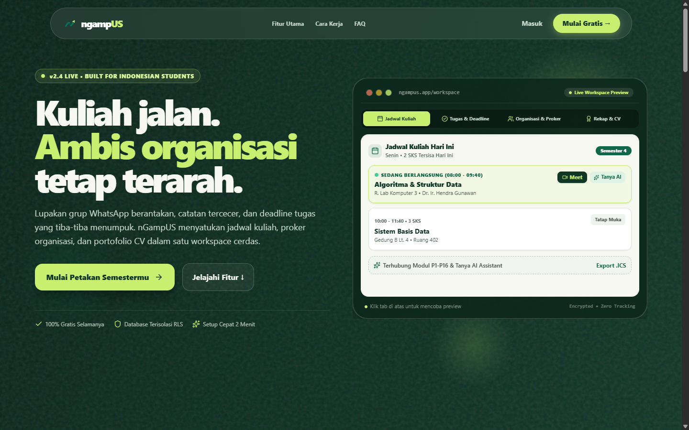
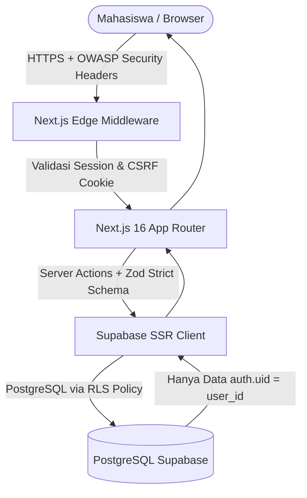

<div align="center">

  

  # **ngampUS**
  ### *The Sovereign Campus Operating System & AI Study Suite*

  <p align="center">
    <b>Workspace cerdas & terintegrasi untuk mahasiswa modern Indonesia. Kendalikan jadwal kuliah, deadline tugas, arsip modul & slide, AI study companion, proker organisasi, hingga rekap portofolio CV siap ekspor dalam satu ekosistem tanpa distraksi.</b>
  </p>

  <p align="center">
    <a href="#-fitur-unggulan">Fitur Unggulan</a> •
    <a href="#-arsitektur-dan-keamanan-siber">Keamanan Siber</a> •
    <a href="#-stack-teknologi">Tech Stack</a> •
    <a href="#-cara-menjalankan-secara-lokal">Cara Menjalankan</a> •
    <a href="#-struktur-proyek">Struktur Proyek</a> •
    <a href="#-kontribusi">Kontribusi</a>
  </p>

  <p align="center">
    
    
    
    
    
    
    
  </p>

  <br/>

  

</div>

---

## 🌟 Mengapa nGampUS Hadir?

Banyak mahasiswa Indonesia menghadapi tantangan yang sama setiap semester:
- 📱 **Informasi Tercecer**: Jadwal perkuliahan dan link Zoom tertimbun ribuan chat grup WhatsApp.
- ⏰ **Deadline Menumpuk Tiba-tiba**: Tugas sering terlupakan karena hanya dicatat di memo HP atau buku catatan yang tercecer.
- 📁 **Berkas & Slide Kuliah Hilang**: PPT dosen, modul PDF, dan catatan rumus sulit dicari saat pekan ujian tiba.
- 👥 **Ritme Organisasi Bentrok**: Tanggung jawab program kerja BEM/Himpunan bertubrukan dengan jam kuliah praktikum.
- 📄 **Kebingungan Bikin CV**: Saat lulus atau melamar magang, prestasi, kepanitiaan, dan riwayat proyek mahasiswa sulit direkonstruksi ulang.

**nGampUS** memecahkan seluruh masalah di atas lewat filosofi **"Campus Atlas & Archival Atelier"**:
- 🧭 **Satu Peta Kendali Terpadu**: Jadwal kelas, modul kuliah, tugas, rapat organisasi, dan kalender akademik saling terkoneksi.
- 🤖 **AI Study Suite Berbasis Dokumen**: Analisis materi modul per pertemuan menggunakan AI yang ter-grounding langsung dengan file PPT/PDF dosen Anda.
- ⚡ **Fokus Produktif**: Dashboard adaptif yang otomatis menghitung deadline terdekat, kelas hari ini, dan target semester.
- 🎯 **Portofolio CV Otomatis**: Setiap kontribusi di kepanitiaan, lomba, dan proker otomatis dirangkum jadi portofolio siap pakai.

---

## 🚀 Fitur Unggulan

### 1. 🎓 Onboarding Interaktif & Guided Spotlight Tour
* **Smart First-Time Detection**: Pengguna baru langsung disambut wizard setup semester interaktif dengan rentang tanggal perkiraan otomatis.
* **1-Minute Spotlight Feature Tour**: Sorotan visual langkah-demi-langkah yang mengenalkan fitur kunci tanpa membuat mahasiswa bingung.
* **Anti-Spam & Replay**: Status tur tersimpan per akun dan dapat diputar kembali kapan saja melalui tombol **Panduan** di sidebar.

### 2. 📅 Jadwal Kuliah Mingguan & Export .ICS
* **Jadwal Mingguan Interaktif**: Pantau kelas hari Senin hingga Minggu lengkap dengan jam, SKS, dosen pengampu, kontak, dan ruangan.
* **Akses Ruang Virtual 1-Klik**: Tombol langsung membuka link Google Meet / Zoom dan Google Drive modul tanpa repot *scroll* chat grup.
* **Sinkronisasi Kalender (.ICS)**: Ekspor jadwal kuliah langsung ke **Google Calendar**, **Apple Calendar**, atau **Outlook** dengan sekali klik.

### 3. 📚 Modul & Arsip Materi (Campus Codex)
* **Arsip Materi P1 - P16**: Kelola slide presentasi dosen, resume catatan kuliah, dan berkas tugas per pertemuan secara rapi.
* **Quick Jump Chip**: Tombol stempel digital untuk melompat langsung ke pertemuan tertentu (`P-01`, `P-02`, dst.).
* **Download & Preview Cepat**: Akses instan file dokumen perkuliahan (PDF, PPTX, DOCX, XLSX).

### 4. 🧠 Grounded AI Study Suite (Powered by Gemini)
* **Rangkuman Esensi AI**: Ekstrak ringkasan konsep inti, definisi kunci, dan prediksi kisi-kisi ujian dari dokumen materi kuliah Anda.
* **Tanya Dosen AI**: Asisten tutor interaktif untuk berdiskusi materi yang belum dipahami atau meminta contoh analogi sederhana.
* **Kuis Evaluasi AI**: Buat 5 butir soal pilihan ganda interaktif beserta pembahasan kunci jawaban untuk persiapan UTS/UAS.

### 5. 📝 Manajemen Kegiatan & Smart Deadline Radar
* **Kaitan Mata Kuliah Otomatis**: Hubungkan tugas dengan mata kuliah dari semester aktif.
* **Smart Deadline Radar**: Peringatan visual warna untuk deadline mendesak (H-1 dan H-2) agar tugas tidak terlewat.
* **Progress Auto-Sync**: Status otomatis bertransisi dari *Belum Mulai* ke *On Progress* saat tanggal pelaksanaan tiba.

### 6. 🏢 Organisasi, Jabatan & Program Kerja (Proker)
* **Struktur Peran Dinamis**: Kelola peran di BEM, Himpunan, UKM, atau kepanitiaan (Ketua, BPH, Kadiv, Staff).
* **Monitoring Proker**: Pantau status dan timeline program kerja dari fase inisiasi, pelaksanaan, hingga evaluasi akhir.

### 7. 🏆 Rekapitulasi Statistik & Portofolio CV
* **Visual Analytics**: Diagram ritme akademik dan produktivitas semester dengan visualisasi kontras tinggi.
* **Auto-Curated Portfolio**: Beri tanda bintang pada kegiatan berprestasi atau proyek penting agar otomatis masuk ke galeri portofolio.
* **Ekspor CSV UTF-8**: Unduh data akademik, riwayat tugas, dan kontribusi organisasi untuk lampiran beasiswa atau arsip pribadi.

---

## 🛡️ Arsitektur dan Keamanan Siber

Data pribadi dan privasi akademik mahasiswa di nGampUS dilindungi dengan prinsip pertahanan berlapis (**Defense-in-Depth**):

| Lapisan Keamanan | Implementasi di nGampUS |
| :--- | :--- |
| **Row Level Security (RLS)** | Seluruh tabel PostgreSQL di Supabase dilindungi RLS ketat (`auth.uid() = user_id`). Tidak ada celah data pengguna lain bocor atau tertukar. |
| **Edge Auth Middleware** | Next.js Edge Middleware memvalidasi sesi otentikasi serta menyegarkan session cookie dengan opsi `SameSite=Lax` & `Secure`. |
| **Content-Security-Policy (CSP)** | Membatasi skrip asing berbahaya dan hanya mengizinkan koneksi aman ke endpoint nGampUS dan Supabase (`*.supabase.co`). |
| **Anti-Clickjacking & MIME Protection** | Header `X-Frame-Options: DENY`, `frame-ancestors 'none'`, dan `X-Content-Type-Options: nosniff`. |
| **Anti-XSS URL Protocol Filter** | Validasi skema URL (`/^https?:\/\//i`) pada link meet, slide, LinkedIn, dan GitHub guna mencegah eksploitasi skrip berbahaya (`javascript:`). |
| **Transport Security (HSTS)** | Memaksa koneksi HTTPS dengan `Strict-Transport-Security` (`max-age=63072000; includeSubDomains; preload`). |



---

## 💻 Stack Teknologi

- **Core Framework**: [Next.js 16 (App Router & Turbopack)](https://nextjs.org/)
- **UI Library**: [React 19](https://react.dev/)
- **Language**: [TypeScript (Strict Mode)](https://www.typescriptlang.org/)
- **Styling**: [Tailwind CSS v4](https://tailwindcss.com/) dengan Custom Archival Design Tokens
- **Database & Auth**: [Supabase](https://supabase.com/) (PostgreSQL, Supabase Auth SSR, Storage & RLS)
- **AI Intelligence**: [Google Gemini AI API](https://ai.google.dev/)
- **Form & Validation**: [React Hook Form](https://react-hook-form.com/) & [Zod](https://zod.dev/)
- **Icons & Visuals**: [Lucide React](https://lucide.dev/)
- **Calendar Engine**: [FullCalendar](https://fullcalendar.io/)

---

## 🛠️ Cara Menjalankan Secara Lokal

### Prasyarat
- Node.js versi 20.x atau lebih baru
- Akun dan project [Supabase](https://supabase.com) aktif

### 1. Kloning Repositori
```bash
git clone https://github.com/YogUNI/nGampUS.git
cd nGampUS
```

### 2. Instalasi Dependensi
```bash
npm install
```

### 3. Konfigurasi Environment Variable
Salin file `.env.example` menjadi `.env.local`:
```bash
cp .env.example .env.local
```
Lengkapi kredensial Supabase dan Gemini AI di file `.env.local`:
```env
NEXT_PUBLIC_SUPABASE_URL=https://your-project.supabase.co
NEXT_PUBLIC_SUPABASE_PUBLISHABLE_KEY=your-anon-key
GEMINI_API_KEY=your-gemini-api-key
```

### 4. Setup Database Supabase
Buka **SQL Editor** di dashboard Supabase Anda, lalu jalankan script berikut secara berurutan:
1. `supabase/schema.sql` (Skema tabel utama, relasi & RLS)
2. `supabase/migrations/20260913_create_courses_table.sql` (Tabel matakuliah)
3. `supabase/migrations/20260914_create_course_modules.sql` (Tabel modul & arsip materi)
4. `supabase/migrations/20260915_create_module_ai_features.sql` (Tabel kuis & chat AI)

### 5. Jalankan Development Server
```bash
npm run dev
```
Akses aplikasi melalui peramban di [http://localhost:3000](http://localhost:3000).

---

## 📁 Struktur Proyek

```text
nGampUS/
├── public/                     # Aset statis, favicon, logo & preview
│   ├── logo_ngampUS.png        # Logo resmi nGampUS
│   └── ngampus-preview.png     # Screenshot tampilan live landing page
├── src/
│   ├── app/
│   │   ├── (auth)/             # Autentikasi: login, register, reset-password
│   │   ├── (dashboard)/        # Workspace mahasiswa
│   │   │   ├── dashboard/      # Command center & ringkasan harian
│   │   │   ├── jadwal/         # Jadwal kuliah mingguan & export kalender
│   │   │   ├── modul/          # Modul perkuliahan & Grounded AI Study Suite
│   │   │   │   └── [id]/       # Detail materi, rangkuman, kuis & chat AI
│   │   │   ├── kegiatan/       # Manajemen tugas, reminder & deadline radar
│   │   │   ├── organisasi/     # Ruang organisasi, peran & program kerja
│   │   │   ├── semester/       # Kalender akademik & kontrol semester
│   │   │   ├── rekap/          # Visual analytics & galeri portofolio CV
│   │   │   └── settings/       # Pengaturan profil, avatar KTM & preferensi
│   │   └── page.tsx            # Landing page publik interaktif
│   ├── components/
│   │   ├── activities/         # Form kegiatan & timeline kalender
│   │   ├── dashboard/          # Sidebar responsif, topbar & quick avatar menu
│   │   ├── modules/            # Modul card, kuis modal, chat AI & summary modal
│   │   ├── onboarding/         # Onboarding wizard & spotlight tour
│   │   ├── schedule/           # Grid jadwal mingguan & modal matkul
│   │   └── landing/            # Komponen interaktif landing page & preview
│   ├── lib/                    # Supabase SSR client, helper & date utilities
│   └── middleware.ts           # Next.js Edge Auth & OWASP Security Shield
├── supabase/
│   ├── schema.sql              # Skema database awal & aturan RLS
│   └── migrations/             # Berkas migrasi database modular
└── next.config.ts              # Konfigurasi Next.js & HTTP Security Headers
```

---

## 🤝 Panduan Kontribusi

Kontribusi dari sesama mahasiswa dan pengembang sumber terbuka selalu kami sambut dengan hangat!
1. **Fork** repositori ini ke akun GitHub Anda
2. Buat branch fitur baru: `git checkout -b fitur/nama-fitur-keren`
3. Commit perubahan Anda: `git commit -m "feat: menambahkan fitur baru"`
4. Push branch Anda: `git push origin fitur/nama-fitur-keren`
5. Buka **Pull Request** dengan deskripsi lengkap tentang apa yang Anda tambahkan/perbaiki

---

<div align="center">
  <p>Dibuat dengan dedikasi penuh untuk kemajuan mahasiswa Indonesia 🇮🇩</p>
  <p>© 2026 <b>nGampUS</b>. Hak Cipta Dilindungi.</p>
</div>
