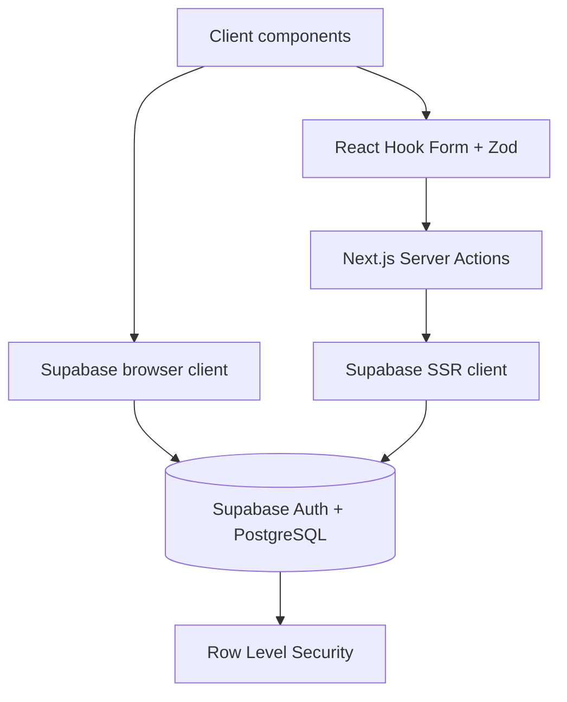

# nGampUS — Project Context for Antigravity

> Dokumen handoff untuk AI agent. Baca seluruh dokumen ini sebelum mengubah kode. Tujuannya agar pengembangan berikutnya melanjutkan arah yang sudah ada, bukan mengulang fondasi atau merusak workflow yang sudah stabil.

## 1. Ringkasan produk

**nGampUS** adalah personal campus command center untuk mahasiswa aktif. Produk ini menyatukan aktivitas akademik, organisasi, jabatan, program kerja, semester, deadline, dan rekap progres dalam satu workspace privat per pengguna.

Tagline utama:

> **Kuliah jalan. Ambis tetap terarah.**

Produk bukan ditujukan sebagai aplikasi manajemen organisasi multi-anggota. Model saat ini adalah **personal workspace**: seorang mahasiswa mengelola rekam jejak dan komitmennya sendiri di banyak organisasi/kepanitiaan.

## 2. Kondisi project saat ini

### Status keseluruhan

| Area | Status | Catatan |
| --- | --- | --- |
| Core workflow | ✅ Selesai | Auth, profil, semester, organisasi, jabatan, proker, kegiatan, rekap, CSV. |
| Database & RLS | ✅ Selesai | Table, FK, constraint, trigger, RLS policy, dan view tersedia. |
| UI/UX | ✅ Selesai untuk MVP | Visual system **Campus Atlas / Campus Console** telah diterapkan. |
| Responsiveness | 🟡 Perlu QA lanjutan | Layout sudah responsif, tetapi QA visual lintas device perlu diteruskan. |
| Automated tests | ❌ Belum ada | Saat ini ada typecheck, lint, dan production build. |
| Deployment / CI | ❌ Belum ada | Belum ada konfigurasi Vercel, GitHub Actions, atau test pipeline. |
| Notifikasi real-time | ❌ Belum ada | Belum ada email/push/WhatsApp reminder. |

### Commit penting terakhir

| Commit | Makna |
| --- | --- |
| `105cec8` | README profesional, preview SVG, dan migration korektif trigger profile. |
| `f62c8b8` | Visual system Login/Register dan Campus Console dashboard. |
| `604127b` | Landing page dirombak menjadi pengalaman Campus Atlas. |
| `ccbd056` | Modal Kegiatan, warna terpusat, dan ringkasan Organisasi. |
| `b1e7e8e` | Lifecycle role organisasi lengkap, termasuk wakil kepala departemen. |

Repository: `https://github.com/YogUNI/nGampUS`

## 3. Prinsip produk dan UX

1. **Personal-first.** Data yang dilihat adalah data milik satu user yang sedang login.
2. **Context over clutter.** Setiap kegiatan seharusnya dapat dihubungkan ke semester, organisasi, dan program kerja.
3. **Fokus sebelum fitur.** Dashboard harus memprioritaskan deadline dekat dan langkah berikutnya.
4. **Tenang tetapi berkarakter.** UI tidak boleh terlihat seperti admin template generik.
5. **Bahasa utama Bahasa Indonesia.** Istilah teknis boleh digunakan seperlunya; copywriting harus singkat, suportif, dan tidak kaku.
6. **Responsive by default.** Jangan memasukkan fixed width yang menyebabkan label/filter terpotong pada layar sempit.

## 4. Visual direction yang wajib dipertahankan

Nama arah visual: **Campus Atlas / Campus Console**.

### Karakter visual

- Hijau tua sebagai warna dominan: ruang kerja yang fokus dan dewasa.
- Mint/lime sebagai aksen fokus dan CTA.
- Background grid halus, ambient glow, panel semi-transparan, dan depth lembut.
- Detail editorial seperti tape, orbit, note/sticker, coordinate marker, atau micro-label boleh digunakan secara hemat.
- Card tidak boleh semua identik; hierarchy dan konteks harus terlihat jelas.
- Jangan kembali ke pola SaaS generik: hero besar + tiga feature-card identik + gradient acak.

### Design tokens utama

Sumber kebenaran ada di `src/app/globals.css`.

| Token | Nilai | Fungsi |
| --- | --- | --- |
| `--brand` | `#0f6849` | Aksi utama, organisasi, state positif. |
| `--brand-dark` | `#0a432f` | Surface gelap dan hover CTA. |
| `--brand-soft` | `#dff3e5` | Background badge/sub-panel hijau muda. |
| `--yellow` | `#d9ee72` | Accent/highlight. |
| `--coral` | `#e57255` | Urgensi/deadline risk. |
| `--ink` | `#10261b` | Teks utama. |
| `--muted` | `#65746a` | Teks sekunder. |
| `--line` | `#dbe5dc` | Border/surface separation. |

### Mapping warna data

Jangan buat warna kategori/status baru secara acak. Gunakan `src/lib/activity-styles.ts`.

| Data | Warna |
| --- | --- |
| Kuliah | Biru |
| Organisasi | Hijau brand |
| Lomba | Amber |
| Event | Ungu |
| Lainnya | Abu-abu |
| Belum mulai | Abu-abu |
| On progress | Biru |
| Selesai | Hijau |
| Deadline ≤ 1–2 hari | Coral/merah |
| Deadline 3 hari | Amber |
| Deadline aman | Hijau/netral |

## 5. Halaman dan workflow yang sudah ada

| Route | Fungsi | Catatan implementasi |
| --- | --- | --- |
| `/` | Landing page Campus Atlas | Landing bersifat marketing, tidak memerlukan auth. |
| `/login` | Login email/password | Menggunakan Supabase browser client. |
| `/register` | Register + profil akademik awal | Mengirim `full_name`, `university`, `major` ke user metadata Supabase. |
| `/dashboard` | Ringkasan semester aktif | KPI, deadline 3 hari, Weekly Pulse. |
| `/kegiatan` | CRUD kegiatan | Form modal, filter, list, status cepat, edit, hapus, calendar. |
| `/organisasi` | Daftar organisasi | Menampilkan badge role dan ringkasan proker. |
| `/organisasi/[id]` | Detail organisasi | CRUD organisasi, jabatan, divisi, dan program kerja. |
| `/semester` | CRUD semester | Satu semester aktif per user. |
| `/rekap` | Rekap & ekspor CSV | Metrik, progress, distribusi kategori, filter semester. |
| `/settings` | Profil pengguna | Nama, universitas, prodi, NIM, telepon, bio. |

## 6. Fitur yang telah selesai

### Authentication dan profile

- Register, login, logout, session SSR, serta dashboard route protection.
- Supabase Auth adalah source of truth untuk email login.
- Trigger `auth.users → public.profiles` membuat profile otomatis ketika user baru terdaftar.
- Register mengirim metadata: `full_name`, `university`, `major`.
- Profile mendukung `email`, `student_id`, `phone`, `bio`, dan `avatar_url`.

### Semester

- Create, update, delete, set active.
- Database memiliki partial unique index agar hanya satu semester aktif per user.
- Trigger juga menonaktifkan semester lain ketika satu semester diaktifkan.
- Dashboard, sidebar, dan filter menggunakan semester aktif sebagai konteks.

### Organisasi, jabatan, dan proker

- Organisasi memiliki tipe: `organisasi`, `ukm`, `ukk`, `kepanitiaan`, `lainnya`.
- Pembuatan organisasi memakai RPC `create_organization_with_position` agar organisasi dan jabatan awal dibuat atomik.
- Role tersedia: `ketua_umum`, `wakil_ketua_umum`, `sekretaris`, `bendahara`, `kepala_departemen`, `wakil_kepala_departemen`, `anggota`, `lainnya`.
- Kepala departemen, wakil kepala departemen, dan anggota wajib mengisi nama departemen dengan huruf kapital di awal.
- Program kerja memiliki peran personal, deskripsi, periode, dan status: `perencanaan`, `berjalan`, `selesai`, `dibatalkan`.

### Kegiatan

- Jenis: `tugas`, `reminder`, `catatan`.
- Kategori: `kuliah`, `organisasi`, `lomba`, `event`, `lainnya`.
- Status: `belum_mulai`, `on_progress`, `selesai`.
- Prioritas: `rendah`, `sedang`, `tinggi`.
- Dapat memiliki tanggal mulai, deadline, jam deadline, atau disimpan tanpa deadline.
- Server action memastikan deadline setelah tanggal mulai dan program kerja berasal dari organisasi yang sama.
- Mendukung filter semester/organisasi/kategori/prioritas/status dan tampilan calendar.

### Rekap

- Metrik total, selesai, berjalan, dan tanpa deadline.
- Progress penyelesaian dan distribusi kategori.
- Filter semester.
- CSV UTF-8 untuk laporan/evaluasi.

## 7. Arsitektur teknis



### Pola kode

- **Server Components**: membaca data untuk halaman dashboard dari Supabase SSR client.
- **Client Components**: modal, input interaktif, FullCalendar, dan auth form.
- **Server Actions**: seluruh mutasi domain (semester, kegiatan, organisasi, posisi, proker, profile) dilakukan melalui action di folder route masing-masing.
- **Validasi**: Zod divalidasi sebelum mutasi database; FK/RLS/constraint database tetap menjadi proteksi lapis kedua.
- **Cache invalidation**: server actions memakai `revalidatePath` untuk memperbarui halaman terkait.
- **Session**: `src/proxy.ts` memvalidasi user melalui `supabase.auth.getUser()`, sedangkan dashboard layout melakukan redirect bila user tidak ada.

### File penting

```text
src/
├── app/
│   ├── (auth)/                         # Login, register, auth layout
│   ├── (dashboard)/
│   │   ├── dashboard/page.tsx           # Dashboard focus map
│   │   ├── kegiatan/                    # Page + server actions
│   │   ├── organisasi/                  # Page, detail route + server actions
│   │   ├── semester/                    # Page + server actions
│   │   ├── rekap/page.tsx
│   │   └── settings/                    # Page + server actions
│   ├── page.tsx                         # Landing Campus Atlas
│   └── globals.css                       # Design system global
├── proxy.ts                              # Refresh / validation session
├── components/
│   ├── activities/                      # Create/edit modal, calendar
│   ├── auth/auth-form.tsx               # Auth UI + Supabase sign-in/up
│   ├── dashboard/sidebar.tsx            # Campus Console navigation
│   ├── organizations/                   # Organization & position form
│   ├── recap/export-csv.tsx
│   └── semester/semester-form.tsx
└── lib/
    ├── activity-styles.ts               # Category/status color mapping
    └── supabase/{client,server}.ts      # Supabase clients
```

## 8. Database dan migration

### Tabel utama

`profiles`, `semesters`, `organizations`, `organization_positions`, `programs`, `activities`.

Ada dua view yang disediakan oleh schema:

- `upcoming_deadlines`
- `items_without_deadline`

### Migration yang harus diketahui

| Urutan | File | Tujuan |
| --- | --- | --- |
| 1 | `supabase/schema.sql` | Schema awal, tabel, FK, trigger, RLS policy, view. Hanya untuk project database baru. |
| 2 | `20260829_expand_profiles.sql` | Menambah email dan field profile; membuat email sync trigger. |
| 3 | `20260830_add_organization_position_roles.sql` | Menambah `role_type` dan RPC create organization + initial position. |
| 4 | `20260830_profile_academic_fields.sql` | Menghapus default kampus/prodi dan mengambil metadata register. |
| 5 | `20260830_fix_profile_academic_trigger_email.sql` | Koreksi trigger final agar profile baru menyimpan email + metadata akademik. |

### Aturan migration yang tidak boleh dilanggar

1. **Jangan menjalankan ulang `schema.sql` pada database existing.**
2. **Jangan mengedit migration yang sudah pernah dijalankan pada production.** Buat migration baru untuk setiap koreksi.
3. Untuk project yang sudah ada, jalankan hanya migration yang belum diterapkan, sesuai urutan.
4. Migration terakhir (`fix_profile_academic_trigger_email`) penting bila `profiles.email` sudah `NOT NULL`.
5. Jangan pernah memasukkan secret atau key ke SQL migration / repository.

## 9. Environment variable

```env
NEXT_PUBLIC_SUPABASE_URL=https://your-project.supabase.co
NEXT_PUBLIC_SUPABASE_PUBLISHABLE_KEY=your_publishable_key
```

- Jangan commit `.env.local`.
- Jangan expose `SUPABASE_SERVICE_ROLE_KEY` ke client atau `NEXT_PUBLIC_*`.
- MVP saat ini tidak membutuhkan service role key.

## 10. Quality gate yang wajib dilakukan

Sebelum menyatakan pekerjaan selesai, jalankan:

```bash
npx tsc --noEmit
npm run lint
npm run build
git diff --check
```

Untuk perubahan UI, lakukan juga QA manual minimum pada desktop dan mobile:

- Landing page `/`
- Login `/login`
- Register `/register`
- Dashboard `/dashboard`
- Kegiatan list dan modal `/kegiatan`
- Organisasi list/detail `/organisasi`
- Rekap `/rekap`

## 11. Hal yang perlu dikembangkan berikutnya

### P0 — stabilitas dan quality assurance

1. **Jalankan dan verifikasi semua migration pada Supabase.** Buat akun test baru, isi kampus/prodi, lalu pastikan `profiles.email`, `profiles.university`, dan `profiles.major` tersimpan.
2. **E2E test workflow utama.** Register → buat semester aktif → buat organisasi + role → buat proker → buat kegiatan → edit/status/complete → cek rekap/CSV → logout/login ulang.
3. **QA responsif.** Uji 360px, 768px, 1024px, dan desktop lebar; cek modal Kegiatan, filter select, sidebar, dan heading panjang.
4. **Tambah feedback UI yang konsisten.** Saat ini error server action dapat tampil sebagai error Next default. Tambahkan toast atau inline action state untuk sukses/gagal.

### P1 — fitur produk bernilai tinggi

1. **Program kerja dependent select.** Pada form kegiatan, pilihan Program Kerja sebaiknya hanya menampilkan proker dari organisasi yang dipilih.
2. **Quick focus / today plan.** Pengguna dapat memilih 1–3 kegiatan utama untuk hari ini tanpa mengubah status kegiatan.
3. **Reminder.** Notifikasi in-app terlebih dahulu; lalu email/push notification untuk deadline mendekat.
4. **Pencarian dan saved filters.** Search judul/deskripsi dan simpan filter per semester.
5. **Riwayat aktivitas.** Audit ringan: kapan kegiatan dibuat, selesai, atau deadline diubah.
6. **Avatar upload.** Gunakan Supabase Storage, policy storage RLS, dan fallback avatar saat file belum ada.

### P2 — scale dan production readiness

1. Password reset, change password, dan konfigurasi production email template.
2. CI GitHub Actions untuk typecheck, lint, build, dan test.
3. Automated component/E2E tests (mis. Vitest + Playwright).
4. Deployment Vercel + environment production + Supabase redirect URL production.
5. Error monitoring dan analytics yang menghormati privasi.
6. Export PDF atau resume kontribusi organisasi sebagai fitur portofolio.

## 12. Guardrail untuk AI yang melanjutkan proyek

1. Jangan menghapus atau mengganti logic RLS, constraint, trigger, dan FK tanpa alasan produk yang jelas serta migration baru.
2. Jangan membuat query client yang membutuhkan service role key.
3. Jangan mengganti schema dengan `schema.sql` untuk perubahan kecil; selalu buat migration baru.
4. Pertahankan Supabase Auth sebagai source of truth untuk email dan session.
5. Pertahankan validasi server action dengan Zod dan cek kepemilikan user (`user_id`).
6. Jangan mengubah bahasa produk menjadi Inggris seluruhnya; UI utama tetap Bahasa Indonesia.
7. Pertahankan Campus Atlas / Campus Console. Jangan mengembalikan UI ke admin dashboard generik atau kartu pastel acak.
8. Jangan mengubah semua halaman hanya lewat CSS global jika perubahan membutuhkan semantics/interaction baru. Buat komponen reusable bila pattern sudah muncul di dua atau lebih halaman.
9. Setelah mengedit, selalu jalankan quality gate dan laporkan hasilnya.
10. Jangan commit secrets, `.env.local`, hasil build, atau file instruksi agent pribadi seperti `CLAUDE.md`.
11. Baca `AGENTS.md` sebelum melakukan perubahan framework-level; project menggunakan Next.js versi baru dan instruksinya mengharuskan referensi dokumentasi lokal Next.js yang relevan.

## 13. Prompt awal yang dapat ditempel ke Antigravity

```text
Kamu melanjutkan proyek nGampUS, personal campus command center berbasis Next.js 16, TypeScript, Tailwind CSS 4, dan Supabase. Baca docs/ANTIGRAVITY_PROJECT_CONTEXT.md serta README.md sebelum membuat perubahan.

Pertahankan konsep produk personal workspace dan visual direction Campus Atlas / Campus Console (dark green, mint/lime accent, editorial, bukan admin dashboard generik). Jangan mengubah Supabase RLS, schema, trigger, atau migration yang sudah ada secara destruktif. Semua perubahan database harus menggunakan migration baru. Jangan expose secret Supabase.

Gunakan server actions + Zod untuk mutasi domain, pastikan operasi selalu scoped ke user saat ini, dan jalankan npx tsc --noEmit, npm run lint, npm run build, serta git diff --check sebelum selesai.

Mulai dengan membaca status project dan tanyakan/kerjakan task berikutnya dengan tetap menjaga fitur yang sudah berfungsi: auth, profile, semester, organisasi/role/proker, kegiatan, kalender, dashboard, rekap, dan CSV export.
```

---

Dokumen ini adalah handoff state project saat ini; perbarui bagian status dan roadmap setelah perubahan fitur besar.
